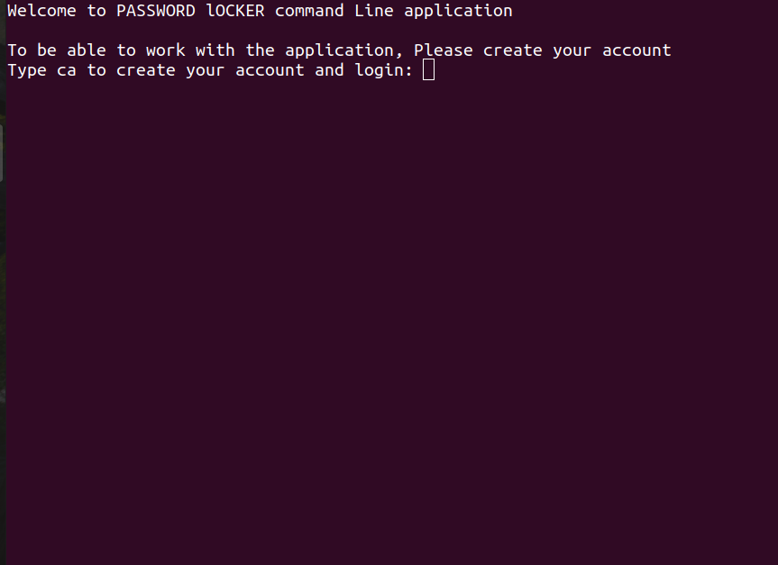

## Author
Caleb Ouma Odinga 

## Password Locker
This aplication is a command line application. Ths means that it can only be run in the command line. The application enables a user to create their password Locker account, login usng the ccoun and create or save already existing account credentials which include, account name, username of the said account and password.
A user can also view all credentials saved, find a specific credential and Delete it. A user can save as much credentials as possible

# User journey.
A user visits the site.
A user creates password Locker account.
A user uses the created account credentials to login.
A user creates or saves account credentials as many as possible.
A user views all created account credentials.
A user finds a specific account credential.
A user deletes the found credential

# Output
A user has a password locker account with saved credentials.

A user can also find and delete any credential in their account. Searching the account credential, one uses the said account name

# Homepage

## Installation
Have Python installed in you machine.

Use git, Github and any editor or IDE to see the codes and the rendered frontend.

The execution is done in terminal. Either computer Terminal or IDE terminal
## Usage

Ensure you have Python installed in you machine. Clone this github repository, git pull to your local machine and code away.

## Contributing
Pull requests are welcome. For major changes, please open an issue first to discuss what you would like to change.

Please make sure to update tests as appropriate.

## Website's link
This aplication is not hosted or live. Github Link is https://github.com/COdingaorg/password_locker

## License
This Website uses MIT LICENSE. For more Read License.

Copyright (c) 2021 Caleb Odinga